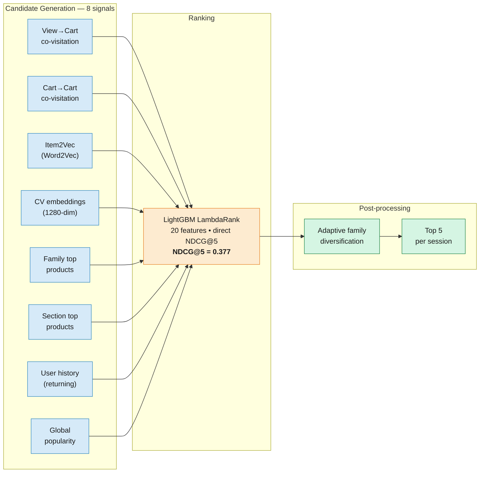

# Inditex E-Commerce Recommender System

[](https://github.com/mponsclo/session-recommender-lambdarank/actions/workflows/lint.yml)
[](https://www.python.org/downloads/)
[](LICENSE)
[](https://github.com/astral-sh/ruff)
[](https://docs.getdbt.com/)
[](https://lightgbm.readthedocs.io/)

Session-based product recommender for Inditex/Zara e-commerce, built for a NUWE hackathon challenge. Two-stage pipeline — **multi-signal candidate generation** + **LightGBM LambdaRank reranker** — handling extreme cold-start (93% of test sessions have no user history, 81% are fully anonymous). Data engineering with **dbt on DuckDB**, ranking with **LightGBM LambdaRank**, sequence embeddings with **Word2Vec/Item2Vec**.

## Results

3/3 tasks complete. NDCG@5 on the offline validation set jumped **35×** from baseline.

| Task | Description | Points | Result |
|------|-------------|--------|--------|
| 1. Data Queries | 7 SQL queries on interactions, products, users | 100 | 7/7 |
| 2. Session Metrics | `get_session_metrics()` function | 100 | 8/8 tests pass |
| 3. Recommender | Top-5 per session, NDCG@5 | 900 | **NDCG@5 = 0.377 · Hit Rate@5 = 76.0%** |

| Metric | Baseline (top-5 popularity) | v1 (binary classifier) | v2 (LambdaRank, improved) |
|--------|------------------------------|------------------------|---------------------------|
| NDCG@5 | ~0.01 | 0.214 | **0.377** |
| Hit Rate@5 | ~5% | 45.5% | **76.0%** |
| Sessions with hit | ~50 | 455 | **760 / 1,000** |

> Validation on 1,000 held-out training sessions with ≥5 cart additions. Because the co-visitation matrix is built from the same training data, scores are optimistic; real test performance may differ.

## Documentation

| Guide | Description |
|-------|-------------|
| [Data Pipeline](docs/1-data-pipeline.md) | dbt + DuckDB: staging → intermediate → marts → features |
| [Candidate Generation](docs/2-candidate-generation.md) | 8 signal sources (co-visitation, Item2Vec, CV embeddings, metadata) |
| [LambdaRank Ranking](docs/3-ranking-lambdarank.md) | LightGBM LambdaRank with 20 features, direct NDCG@5 optimization |
| [Lessons Learned](docs/4-lessons-learned.md) | What failed, what changed, what we'd do differently |
| [EDA Findings](docs/eda_findings.md) | Detailed exploratory analysis (93% cold-start, family structure, co-visitation) |

**Notebook:** [exploratory analysis](notebooks/eda.ipynb)

## Architecture



**Stage 1 — Candidate Generation.** For each test session, 8 independent signals contribute ~50–150 candidate products. Candidates are deduplicated into a single pool; each carries an 8-dimensional score vector (one field per source, zero where it didn't contribute). See [docs/2](docs/2-candidate-generation.md).

**Stage 2 — Ranking.** A LightGBM LambdaRank model scores every candidate with 20 features (co-visitation scores, embedding similarities, product metadata, session context, user features). Direct NDCG@5 optimization rather than proxy classification. Top-5 selected with adaptive per-family diversification. See [docs/3](docs/3-ranking-lambdarank.md).

Inspired by [OTTO Kaggle](https://www.kaggle.com/competitions/otto-recommender-system) winning approaches and session-based recommendation research ([Ludewig & Jannach, 2018](https://arxiv.org/abs/1803.09587)).

## Lessons Learned

Full writeups in [docs/4-lessons-learned.md](docs/4-lessons-learned.md). Four decisions, each measured on the 1,000-session offline validation set:

- **Training distribution must match test distribution.** Training only on 5+ cart sessions (avg 53 interactions) hurt on test (avg 4). Dropping the filter and truncating viewed products to the last 10: NDCG@5 **0.214 → 0.377** — largest single lift.
- **Excluding viewed products from candidates wrecked recall.** 24.2% of cart adds go to products viewed earlier in the same session. Including them + adding a `is_viewed_in_session` feature: Hit Rate@5 **~45% → 76%**.
- **Adaptive diversification beat hard per-family caps.** A rigid max-3-per-family displaced high-scoring candidates on focused sessions. Adaptive cap (up to 4 when the dominant family has ≥3 above-median candidates) recovered NDCG@5 +0.015.
- **LambdaRank over pointwise classification.** Direct NDCG optimization beat a tuned binary classifier by ~0.05 NDCG@5, and simplified hyperparameter search since validation score is the thing being optimized.

## Data Pipeline (dbt + DuckDB)

All data transformations managed with dbt against a DuckDB file at `transform/target/inditex_recommender.duckdb`:

```
Raw CSVs → Staging (views) → Intermediate (tables) → Marts (tables) → Features (tables)
```

- **Staging**: type casting, column renaming, train/test split tagging
- **Intermediate**: session aggregation, product statistics, user profiles
- **Marts**: `dim_products`, `dim_users`, `dim_sessions`, `fct_interactions`
- **Features**: `feat_recommendation_input` (final wide table), `feat_product_popularity`, `feat_user_behavior`, `feat_session_context`

Full layer-by-layer reference in [docs/1-data-pipeline.md](docs/1-data-pipeline.md).

## EDA Insights

Full analysis in [docs/eda_findings.md](docs/eda_findings.md). Selected findings that shaped the model:

- **Product `cart_addition_rate`** is the strongest product-level predictor (varies 0–100%)
- **Co-view to cart is strongly same-family**: top 20 view-to-cart pairs are all within the same family
- **Cross-family co-carts represent 43%** of pairs — diversification matters
- **Mid-popularity products** (500–999 interactions) have the highest cart rate (7.0%)
- **Device 3** has 9.0% cart rate vs Device 1's 5.7% — potential segmentation opportunity
- **97%** of test products also appear in training data — product-level features are reliable

## Quick Start

```bash
git clone https://github.com/mponsclo/session-recommender-lambdarank.git
cd session-recommender-lambdarank
python -m venv .venv && source .venv/bin/activate

make install        # Python dependencies
make dbt-build      # requires data/raw/ — see Data Notice
make test           # Task 2: 8/8 should pass
make predict        # Task 3: generates predictions/predictions_3.json (~15 min)
make lint           # Ruff check + format check
```

Run `make help` to see all targets.

## Project Structure

```
├── src/
│   ├── data/
│   │   └── session_metrics.py   # Task 2: get_session_metrics()
│   ├── explore/
│   │   └── queries.py           # Task 1: 7 SQL queries
│   └── models/
│       ├── predict_model.py     # Task 3: two-stage inference pipeline
│       └── train_model.py       # Task 3: LambdaRank training
├── src_java/                    # Java fallback for Task 2 (Tablesaw + pom.xml)
├── transform/                   # dbt project (DuckDB)
│   └── models/                  # staging → intermediate → marts → features
├── tests/                       # pytest suite for Task 2 (8 tests)
├── notebooks/
│   └── eda.ipynb                # Exploratory analysis
├── docs/                        # Technical deep-dives (1-data-pipeline through 4-lessons-learned)
├── data/raw/                    # Raw CSVs + product embeddings (proprietary, not committed)
├── predictions/                 # Task outputs (predictions_1.json, predictions_3.json)
├── .github/workflows/           # Ruff lint CI
├── Makefile                     # install, dbt-build, test, predict, lint, format
├── pyproject.toml               # Ruff configuration
└── requirements.txt             # Pinned Python dependencies
```

A Java implementation of Task 2 using [Tablesaw](https://github.com/jtablesaw/tablesaw) lives at `src_java/main/java/java_function/SessionMetrics.java` with build config in `pom.xml` — provided as an alternative to the Python solution.

## Tech Stack

- **Python 3.12** — pandas, numpy, scipy, scikit-learn
- **LightGBM 4.6** — LambdaRank for NDCG-optimized ranking
- **Gensim 4.4** — Word2Vec for Item2Vec product embeddings
- **dbt + DuckDB** — data transformation pipeline
- **Jupyter** — exploratory data analysis
- **Ruff + GitHub Actions** — linting and CI

## Data Notice

The datasets were provided by Inditex through the NUWE hackathon platform and are **not included** in this repository. The data comprises user interactions (~46.5M rows), product catalog (43,692 products), user RFM profiles (577K users), and product CV embeddings — all proprietary to Inditex.

Because the data is proprietary, this repo cannot be re-run end-to-end from a clean clone. The code, methodology, documentation, and reported results are the deliverable.

## License

[MIT](LICENSE)
